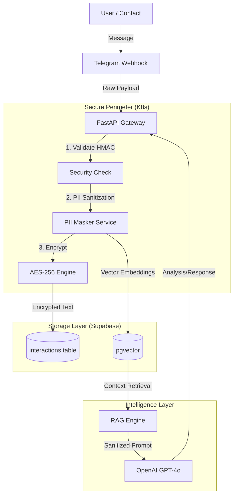

# 🛡️ SECURE CONTACT INTELLIGENCE (SCI) — TECHNICAL SPECIFICATION
**Version:** 2.0 (Security Enhanced)
**Status:** DRAFT
**Author:** Super Brain Architect

---

## 1. EXECUTIVE SUMMARY
Модуль для агрегации, анализа и автоматизации общения с контактами (Telegram, WhatsApp, Email).
**Ключевое отличие v2.0:** Внедрение **Zero-Trust Architecture**. Ни одно сообщение не хранится в открытом виде, ни одно сообщение не уходит в AI без очистки PII. Используется Vector Search для долгосрочной памяти.

---

## 2. ARCHITECTURE: "THE VAULT"

---

## 3. DATA SECURITY PROTOCOLS

### 3.1. Encryption at Rest (Шифрование)
Все поля `message_text` и `response_text` в таблице `interactions` хранятся **ТОЛЬКО** в зашифрованном виде.
- **Algorithm:** AES-256-GCM
- **Key Management:** Ключ шифрования хранится в Kubernetes Secrets (не в коде, не в БД).
- **Decryption:** Происходит только "на лету" внутри FastAPI пода при запросе от авторизованного пользователя.

### 3.2. PII Redaction (Очистка данных)
Перед отправкой текста в OpenAI для анализа или векторизации:
1. Regex-фильтры находят: Email, Phone, Credit Card, Crypto Address.
2. NER (Named Entity Recognition) находит: Имена, Локации.
3. Замена на токены: `[EMAIL_REDACTED]`, `[PHONE_REDACTED]`.

---

## 4. INTELLIGENCE FEATURES (BRAIN)

### 4.1. Semantic Memory (RAG)
Используем расширение `pgvector`.
- Каждое сообщение превращается в вектор (embedding).
- При новом сообщении от Никиты, система ищет топ-3 похожих диалога из прошлого (даже годичной давности).
- **Результат:** Агент отвечает с учетом контекста *всех* лет знакомства.

### 4.2. Style Mimicry (Подражание стилю)
Система анализирует последние 500 ваших *исходящих* сообщений этому контакту.
- Вычисляет: среднюю длину, частоту emoji, сленг, время реакции.
- Генерирует `style_prompt` для GPT, чтобы автоответ был неотличим от вас.

---

## 5. DATABASE SCHEMA (SUPABASE)

### Extensions required:
- `pgcrypto` (для хэширования)
- `vector` (для AI памяти)

### Tables Update:

#### `contacts` (Enhanced)
- `communication_fingerprint`: JSONB (ML-модель вашего стиля общения с этим человеком)
- `trust_level`: INT (1-5, влияет на то, что можно отправлять в AI)

#### `interactions` (Secure)
- `message_encrypted`: TEXT (вместо message_text)
- `embedding`: VECTOR(1536) (для поиска)
- `is_sanitized`: BOOLEAN

---

## 6. INTEGRATION WORKFLOWS

### 6.1. Secure Ingestion Pipeline (FastAPI + n8n)
1. **n8n** получает Webhook (Telegram/WhatsApp).
2. **n8n** НЕ ЛЕЗЕТ в базу сам. Он делает POST запрос на ваш Secure API (`97v.ru/api/v1/ingest`).
3. **API** проводит санитизацию, шифрование и сохранение.
4. **API** возвращает в n8n только статус (Success).
5. **n8n** отправляет уведомление вам (если нужно).

*Почему так?* n8n — это публичное облако. Мы не доверяем ему хранение ключей шифрования. Ключи только в вашем K8s.

---

## 7. IMPLEMENTATION PLAN

### Phase 1: The Foundation (Week 1)
- [ ] Deploy `pgvector` & `pgcrypto` on Supabase.
- [ ] Update Kubernetes Secrets with `ENCRYPTION_KEY`.
- [ ] Create FastAPI endpoint `/ingest` with PII scrubber.

### Phase 2: The Memory (Week 2)
- [ ] Script to migrate & vectorize old Telegram history.
- [ ] Implement RAG search logic.

### Phase 3: The Automation (Week 3)
- [ ] Connect n8n webhooks to Secure API.
- [ ] Activate "Style Mimicry" for Nikita Sokolov.
