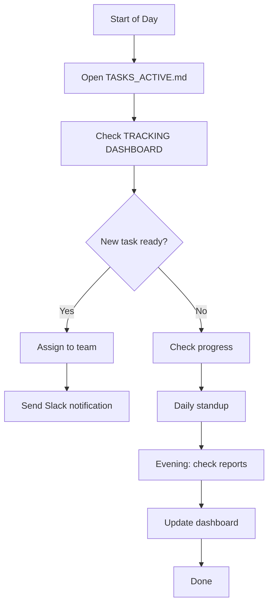
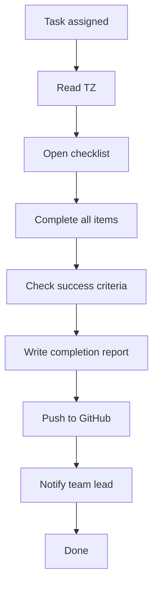

# 📄 MASTER INDEX — Super Brain Digital Twin Documentation

**📅 Дата:** 7 декабря 2025, 14:10 MSK  
**🟢 Статус:** ACTIVE & UPDATED

---

# 🌟 QUICK NAVIGATION

## 👤 ДЛЯ TEAM LEAD / VIK

**👀 START HERE:**
1. 📃 [SYSTEM_README.md](./SYSTEM_README.md) — Complete system overview
2. 📃 [TASK_MANAGEMENT_SYSTEM.md](./TASK_MANAGEMENT_SYSTEM.md) — All TZ & TRACKING DASHBOARD
3. 📃 [TASKS_ACTIVE.md](./TASKS_ACTIVE.md) — This week's active tasks

**📊 DAILY ROUTINE:**
- 09:00 — Open TASKS_ACTIVE.md (what starts today?)
- 10:00 — Standup with teams
- 16:00 — Check for COMPLETION REPORTS
- 17:00 — Update TRACKING DASHBOARD

**💼 KEY DECISIONS:**
- Which task starts next?
- Who is assigned?
- Are there blockers?
- Time to escalate?

---

## 💼 ДЛЯ TEAMS (INFRA, PRODUCT, AI-ML, SECURITY)

**👀 START HERE:**
1. 📃 [QUICK_START_GUIDE.md](./QUICK_START_GUIDE.md) — Understand the system
2. 📃 [TASKS_ACTIVE.md](./TASKS_ACTIVE.md) — Find your current task
3. 📃 [TASK-XXX-TEAM-CHECKLIST.md](./TASKS/) — Step-by-step instructions

**📊 YOUR WORKFLOW:**
1. **Morning:** Read your TZ and checklist
2. **During day:** Complete all checklist items
3. **Evening:** Write COMPLETION REPORT
4. **Commit:** Push to GitHub & notify TL

**💼 WHAT YOU NEED:**
- GitHub links to code/docs
- Step-by-step checklist
- Criteria of success
- Troubleshooting guide
- Report template

---

# 📂 DOCUMENTATION FILES

## 🔴 TIER 1: Master Documents

| File | Purpose | For | Access |
|:---|:---|:---|:---:|
| **SYSTEM_README.md** | System overview & benefits | Everyone | [Open](./SYSTEM_README.md) |
| **INDEX.md** | Navigation guide (this file) | Everyone | [Open](./INDEX.md) |
| **QUICK_START_GUIDE.md** | How to use the system | Teams & TL | [Open](./QUICK_START_GUIDE.md) |

## 🟠 TIER 2: Management Documents  

| File | Purpose | For | Updated |
|:---|:---|:---|:---:|
| **TASK_MANAGEMENT_SYSTEM.md** | All TZ + full descriptions | TL & Teams | Daily |
| **TASKS_ACTIVE.md** | Current week assignments | TL & Teams | Daily |
| **TRACKING_DASHBOARD** | Progress tracking | TL (in TASK_MANAGEMENT_SYSTEM.md) | 16:00 daily |

## 🟡 TIER 3: Task-Specific Documents

### TASK-002: Batch Analyzer

| File | Purpose | For | Status |
|:---|:---|:---|:---:|
| [TASK-002-batch-analyzer.md](./TASKS/TASK-002-batch-analyzer.md) | Full specification | INFRA | ✅ Ready |
| [TASK-002-INFRA-CHECKLIST.md](./TASKS/TASK-002-INFRA-CHECKLIST.md) | Detailed checklist | INFRA | ✅ Ready |
| [TASK-002-BATCH-ANALYZER-COMPLETED.md](./TASKS/) | Completion report | INFRA | ⏳ Pending |

**GitHub Links for TASK-002:**
- Code: https://github.com/vik9541/super-brain-digital-twin/blob/main/batch_analyzer.py
- Dockerfile: https://github.com/vik9541/super-brain-digital-twin/blob/main/Dockerfile.batch-analyzer
- K8s Configs: https://github.com/vik9541/super-brain-digital-twin/tree/main/k8s

### TASK-003: Reports Generator

| File | Purpose | For | Status |
|:---|:---|:---|:---:|
| [TASK-003-REPORTS-GENERATOR.md](./TASKS/TASK-003-REPORTS-GENERATOR.md) | Full specification | PRODUCT | ✅ Ready |
| TASK-003-PRODUCT-CHECKLIST.md | Detailed checklist | PRODUCT | 📝 Coming |
| TASK-003-REPORTS-GENERATOR-COMPLETED.md | Completion report | PRODUCT | ⏳ Pending |

**GitHub Links for TASK-003:**
- Code: https://github.com/vik9541/super-brain-digital-twin/blob/main/reports_generator.py
- Requirements: https://github.com/vik9541/super-brain-digital-twin/blob/main/requirements.reports.txt

### TASK-004: Grafana Dashboard

| File | Purpose | For | Status |
|:---|:---|:---|:---:|
| [TASK-004-GRAFANA-DASHBOARD.md](./TASKS/TASK-004-GRAFANA-DASHBOARD.md) | Full specification | INFRA | ✅ Ready |
| TASK-004-INFRA-CHECKLIST.md | Detailed checklist | INFRA | 📝 Coming |
| TASK-004-GRAFANA-DASHBOARD-COMPLETED.md | Completion report | INFRA | ⏳ Pending |

**GitHub Links for TASK-004:**
- Dashboard: https://github.com/vik9541/super-brain-digital-twin/blob/main/monitoring/grafana-dashboard.json
- Prometheus rules: https://github.com/vik9541/super-brain-digital-twin/tree/main/monitoring

### TASK-005: API Extensions

| File | Purpose | For | Status |
|:---|:---|:---|:---:|
| TASK-005-API-EXTENSIONS.md | Full specification | AI-ML | 📝 Coming |
| TASK-005-AI-ML-CHECKLIST.md | Detailed checklist | AI-ML | 📝 Coming |
| TASK-005-API-EXTENSIONS-COMPLETED.md | Completion report | AI-ML | ⏳ Pending |

**GitHub Links for TASK-005:**
- API Code: https://github.com/vik9541/super-brain-digital-twin/blob/main/api/main.py
- Tests: https://github.com/vik9541/super-brain-digital-twin/blob/main/tests/test_api_extensions.py

---

# 📋 COMPLETION REPORTS FOLDER

Когда задача завершена, создается файл:

```
TASKS/TASK-002-BATCH-ANALYZER-COMPLETED.md
TASKS/TASK-003-REPORTS-GENERATOR-COMPLETED.md
TASKS/TASK-004-GRAFANA-DASHBOARD-COMPLETED.md
TASKS/TASK-005-API-EXTENSIONS-COMPLETED.md
```

Эти файлы содержат:
- ✅ Что было сделано
- ✅ Критерии успеха
- ✅ Метрики выполнения
- 🔗 GitHub references
- 📸 Screenshots/proof

---

# 🗺️ FILE STRUCTURE

```
super-brain-digital-twin/
├── 📄 INDEX.md (this file)
├── 📄 SYSTEM_README.md (system overview)
├── 📄 QUICK_START_GUIDE.md (how to use)
├── 📄 TASK_MANAGEMENT_SYSTEM.md (master TZ)
├── 📄 TASKS_ACTIVE.md (weekly tasks)
│
├── 📁 TASKS/
│   ├── TASK-001-TELEGRAM-BOT-COMPLETED.md ✅
│   ├── TASK-002-batch-analyzer.md
│   ├── TASK-002-INFRA-CHECKLIST.md
│   ├── TASK-002-BATCH-ANALYZER-COMPLETED.md (pending)
│   ├── TASK-003-REPORTS-GENERATOR.md
│   ├── TASK-003-REPORTS-GENERATOR-COMPLETED.md (pending)
│   ├── TASK-004-GRAFANA-DASHBOARD.md
│   ├── TASK-004-GRAFANA-DASHBOARD-COMPLETED.md (pending)
│   ├── TASK-005-API-EXTENSIONS.md (coming)
│   └── TASK-005-API-EXTENSIONS-COMPLETED.md (pending)
│
├── 📁 k8s/
│   ├── batch-analyzer-rbac.yaml
│   ├── batch-analyzer-cronjob.yaml
│   └── ...
│
├── 📁 monitoring/
│   ├── grafana-dashboard.json
│   ├── prometheus-custom-metrics.yaml
│   ├── prometheus-alert-rules.yaml
│   └── ...
│
├── 📁 api/
│   └── main.py
│
└── 📁 tests/
    ├── test_api_extensions.py
    └── ...
```

---

# 🔄 WORKFLOW SUMMARY

## ДЛЯ TEAM LEAD



## ДЛЯ TEAMS



---

# 📞 SUPPORT & ESCALATION

**Level 1: Documentation**
- Read QUICK_START_GUIDE.md
- Check TASK-XXX-TEAM-CHECKLIST.md
- Find troubleshooting section

**Level 2: Slack**
- Post in #super-brain-issues
- Tag your team lead
- Describe the problem

**Level 3: Direct**
- @Pavel T. (INFRA Lead)
- @Elena R. (PRODUCT Lead)  
- @Andrey M. (AI-ML Lead)
- @vik9541 (Project Lead) for CRITICAL

---

# ✅ SUCCESS CRITERIA

**By December 13, 2025:**
- ✅ All 5 tasks have COMPLETION REPORTS
- ✅ TRACKING DASHBOARD shows 100% for each
- ✅ Zero open blockers
- ✅ All teams trained and ready

**By December 20, 2025:**
- ✅ Production deployment complete
- ✅ Performance optimized
- ✅ Team handoff done
- ✅ Project celebrations 🎉

---

# 🔗 GITHUB REPOSITORY

Main repo: https://github.com/vik9541/super-brain-digital-twin

**Key folders:**
- `/TASKS` — All task documentation
- `/k8s` — Kubernetes configs  
- `/monitoring` — Prometheus & Grafana
- `/api` — API code
- `/tests` — Test suites

---

# 📊 LEGEND

| Symbol | Meaning |
|:---|:---|
| ✅ | Completed, ready, or approved |
| 📝 | In progress or coming soon |
| ⏳ | Pending or waiting for input |
| 🚀 | Critical path item |
| 🔴 | Urgent/blocker |
| 🟡 | Important |
| 🟢 | Low priority/completed |

---

**🌟 System Status: ACTIVE**  
**Last Updated: 7 Dec 14:10 MSK**  
**Next Update: Daily 16:00 MSK**
